- [1. Gulp](#1-gulp)
  - [1.1 Gulp能做什么](#11-gulp能做什么)
  - [1.2 Gulp使用](#12-gulp使用)
  - [1.3 使用](#13-使用)
  - [1.4 安装Gulp](#14-安装gulp)
  - [1.5 Gulp的基本使用](#15-gulp的基本使用)
    - [（1）Gulp常用API如下：](#1gulp常用api如下)
        - [gulp.pipe()](#gulppipe)
        - [gulp.task()](#gulptask)
    - [（2）文件匹配](#2文件匹配)
    - [（3）Gulp监听](#3gulp监听)
        - [gulp.watch()](#gulpwatch)
    - [（4）Gulp插件](#4gulp插件)
        - [gulp-sass](#gulp-sass)
        - [gulp-clean-css](#gulp-clean-css)
        - [gulp-csso](#gulp-csso)
        - [gulp-less](#gulp-less)
        - [gulp-rename](#gulp-rename)
        - [gulp-concat](#gulp-concat)
        - [gulp-uglify](#gulp-uglify)
        - [gulp-watch](#gulp-watch)
        - [gulp-connect服务器](#gulp-connect服务器)
        - [gulp-connect浏览器自动刷新](#gulp-connect浏览器自动刷新)
        - [gulp-imagemin](#gulp-imagemin)
        - [gulp-pngquant](#gulp-pngquant)
  - [1.6 问题](#16-问题)
- [2. less](#2-less)


- # 1. Gulp

[链接](https://www.gulpjs.com.cn/docs/api/vinyl-isvinyl/)

基于node平台发的前端构建工具

## 1.1 Gulp能做什么

gulp是一个自动化构建工具，他可以做一些自动化的任务，如：

- 项目上线，HTML、CSS、JS文件压缩合并
- 语法转化（es6、less...）
- 公共文件抽离
- 修改文件浏览器自动刷新
- ...

## 1.2 Gulp使用

- 使用npm install gulp下载gulp库文件
- 在项目根目录下简历gulpfile.js文件
- 重构项目的文件夹结构src目录放置源代码文件dist目录放置构建文件
- 在gulpfile.js文件中编写任务
- 在命令工具中执行gulp任务

## 1.3 使用

node -v 查看安装的node js 版本

## 1.4 安装Gulp

安装gulp到本地：

- 在全局安装gulp

`npm install gulp -g`

`gulp -v` 查看安装的gulp版本

- 进入到想要开发项目的这个目录

注：Windows分磁盘操作

--（默认是C盘）D: +回车

--cd +拖动文件夹到cmd中（目录路径）

--windows清屏：cls

- 初始化当前目录

`npm init`   //在项目目录下创建 package.json 文件，这个文件是专门用来存放当前项目的配置信息

此时输出如下：

   //当前项目的名字，gulpdemo是默认名字

   //默认版本

   //当前项目的描述

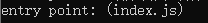   //入口文件，不用设置

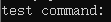   

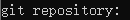  //项目是否要连接到GitHub仓库去

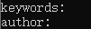 //关键字 和 作者

   //协议

- 在当前项目里安装gulp到本地

`npm install gulp --save-dev `

--save  将这个文件，安装到本地的当前文件夹

-dev  将安装gulp的信息保存在package.json里面

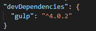   //此时版本号是4.0.2 违背了使用版本的原则（原则是最新的版本不用），因此要换掉此时版本，而且4.0版本的语言用法也大有改变

操作：删除`"gulp": "^4.0.2"`；删除项目里的node_modules文件；重新下载`npm install gulp@3.9.1 --save-dev `，这个命令

可以简化成`npm i gulp@3.9.1 -D`

此时：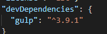 

- 在项目根目录下，创建gulpfile.js的文件，专门gulp去编写任务的

语法规范：CommonJS规范

--requi() 将这个模块引入

--使用这个模块上的函数

`const gulp = require("gulp");`  //const即声明一个不可改变的gulp

- gulpfile.js中编写任务，需要在控制台通过gulp任务名，运行你编写好的任务

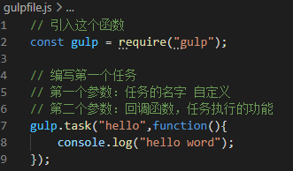 

控制台输入`gulp hello`

## 1.5 Gulp的基本使用

### （1）Gulp常用API如下：

- gulp.src()：获取任务要处理的文件，转换成数据流输出
- gulp.dest()：输出文件（目的文件），如果设置的这个目的文件路径不存在，会自动创建
- gulp.task()：建立gulp任务
- gulp.watch()：监控文件的变化
- gulp.run()：运行任务
- gulp.pipe()：理解程序运行管道

---

##### gulp.pipe() 

对于gulp.pipe()  //拷贝文件，列举一下几个功能：

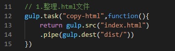 输入`npm copy-htmfilel`

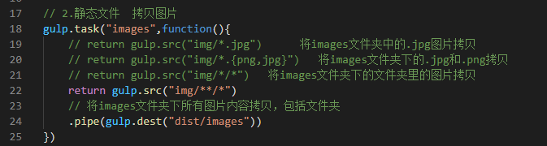 

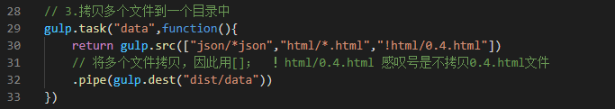 

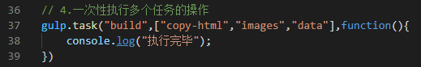 

##### gulp.task()

一次性执行多个任务 

```js
// 构建任务
// 当在命令行执行 default 任务时，会依次执行后面的任务
gulp.task('default', ['htmlmin', 'cssmin', 'jsmin', 'copy']);
```

对于4.0版本：

```js
// 构建任务
// 当在命令行执行 default 任务时，会依次执行后面的任务
// gulp.series|4.0 依赖顺序执行
// gulp.parallel|4.0 多个依赖嵌套'html','css','js'并行
gulp.task('default', gulp.series(gulp.parallel('htmlmin','cssmin','jsmin','copy')));
```

**注意：**如果说任务名称叫 default，那么执行任务的时候就可以只输入：gulp，会自动地去找一个名字叫 default 的任务。

### （2）文件匹配

往往我们在使用src方法的时候需要输入多个或者一类文件，而不仅仅是某个具体的文件，这时我们就可以使用gulp提供的匹配规则来处理。

- `"src/file.js"`：单个文件
- `["src/file1,src/file2.js"]`：多个文件
- `*`: 所有文件
- **：0或者多个文件夹
- {}：多个属性
- !：排除

```js
src('src/*.js') // src自身目录所有的js文件，不含后代文件夹中
src('src/a*c.js') 

src('src/**/*.js') // src目录所有的js文件，含后代文件夹中的

src('src/*.{jpg,png,gif}') // src自身目录下的所有jpg、png和gif文件

src(['**/*.js', '!node_modules/**']) // 所有的js文件，但是node_modules下的除外
```

注意：src 接收的文件匹配字符串会顺序解释，所以你可以写成这样 `gulp.src(['.js', '!b.js', 'bad.js'])`（排除所有以 b 开头的 JS 文件但是除了 `bad.js`）

### （3）Gulp监听 

##### gulp.watch()

监听，如果监听到文件有所改变，会自动去执行对应的任务，更新数据

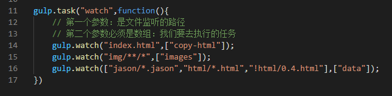 

**gulp4.0版本**

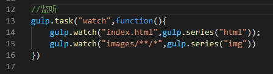 

写法二：

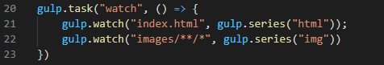 

### （4）Gulp插件

npm install --global xxx属于全局安装

npm install xxx属于本地安装

使用第三方插件的步骤：commonJS规范

--下载插件到本地

cpm install 插件名字 --save-dev    简写：npm i 插件名字 -D

--通过require（）引入文件

--通过 [官网](https://gulpjs.com/docs/en/getting-started/quick-start) 查阅插件的用

##### gulp-sass

gulp可将.scss文件编译成.css文件

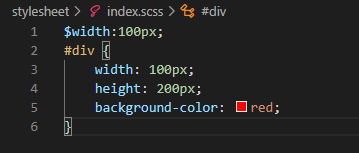 

gulpfile.js中：

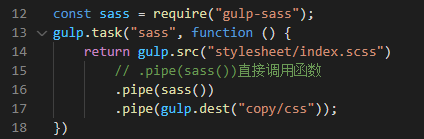 

##### gulp-clean-css

//压缩css的插件

开发版本 index.css

上线版本 即压缩后

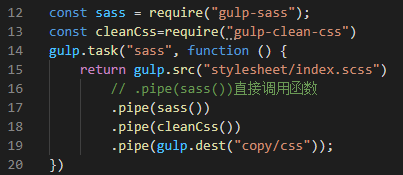 

##### gulp-csso

//把css文件进行压缩

```js
const csso = require('gulp-csso');
// Css 任务
// 1. less 语法转换
// 2. css 代码压缩
gulp.task('cssmin', () => {
  // 使用 gulp.src() 获取 css 目录下的所有 less 文件及 css 文件
  gulp.src(['./src/css/*.less', './src/css/*.css'])
    // 将 less 语法进行转换
    .pipe(less())
    // 压缩 css 文件中的代码
    .pipe(csso())
    // 将处理后的文件输出到 dist/css 目录
    .pipe(gulp.dest('./dist/css'))
});
```

##### gulp-less

less 语法转换为 css 语法

```js
// 引用 gulp-less 插件
const less = require('gulp-less');

// Css 任务
gulp.task('cssmin', () => {
  // 使用 gulp.src() 获取 css 目录下的所有 less 文件
  gulp.src('./src/css/*.less')
    // 将 less 语法进行转换
    .pipe(less())
    // 将处理后的文件输出到 dist/css 目录
    .pipe(gulp.dest('./dist/css'))
});
```


##### gulp-rename

//重命名插件

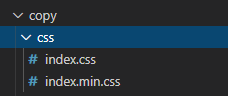 

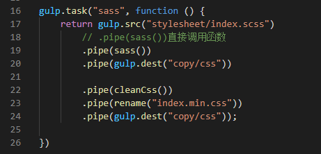 

##### gulp-concat 

 ///作用是合并文件

可以用于处理js文件的插件 ，如将两个js文件合并成一个js文件

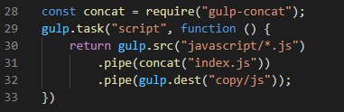  

其中，`.pipe(concat('index.js'))`  //将合并后的文件命名

##### gulp-uglify

//压缩js文件插件,对于es5 的代码

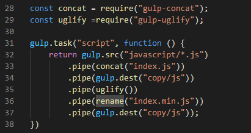  

##### gulp-watch

//针对gulp4.0版本

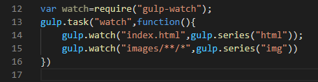 

##### gulp-connect服务器

//用于启动服务器

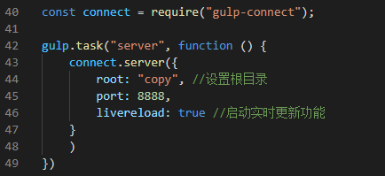 

此时可访问localhost：8888

##### gulp-connect浏览器自动刷新

实现原理：通过在本地开启一个websocket服务，检测文件变化，当文件被修改后触发livereload任务，推送消息给浏览器刷新页面。

```js
//定义livereload任务
gulp.task('connect', function () {
     connect.server({
         livereload: true
    });
 });
```

此时，若要让每个任务进行实时刷新，即在每个任务后面添加

`.pipe(connect.reload());`

---

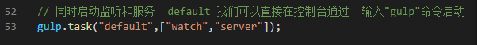 

##### gulp-imagemin

//压缩图片文件

##### gulp-pngquant

//png图片压缩

---

注：给他人代码的时候，node_models删除

拿到这个项目后：进入目录重新下载所有依赖文件，命令输入`npm install`

## 1.6 问题

- 问题1：node的12.0以上版本需要gulp4.0以上版本，不然会有许多不兼容问题

- 问题2：由于的gulp版本v3，node版本v12。报错：ReferenceError: primordials is not defined

解决：

 将gulp版本升级到v4。

 将node版本降级到v11。

 将graceful-fs升级到在node v12+下工作的版本4.2.2(推荐）。

- 问题3：ReferenceError: primordials is not defined

解决：node和gulp版本冲突，即node11.版本和gulp3.版本

- 问题4： EISDIR: illegal operation on a directory, symlink

解决：安装node.js的*盘，格式是FAT32，需要转换成NTFS格式。

操作：转换硬盘格式--输入”cmd“命令--输入命令“vol *:”--输入命令“convert *: /fs:ntfs”--右击磁盘--属性--可查看当前磁盘的文件系统格式。

- 问题5：

  ```
  npm WARN xxxxxxx@1.0.0 No description
  npm WARN xxxxxxx@1.0.0 No repository field.
  ```

  No description: 这个警告是说这个项目的描述为空，npm init的时候一路回车按，最后都会报这个。

- 问题6：安装gulp-imagemin失败

解决：npm安装gulp-imagemin失败，换成cnpm安装。若cnpm安装还是报错`platform unsupported babel-loader@...` 

`npm install -g cnpm --registry=https://registry.npm.taobao.org`

解决：[链接](https://www.cnblogs.com/mengzhiyao/p/9069700.html) 将报错的依赖重新安装一下；

npm/cnpm  install xxx --save  

然后cnpm install ,在重启下服务。

----

[参考链接1](https://www.cnblogs.com/joe235/p/12759205.html)

[参考链接2](https://www.pianshen.com/article/5668260332/)

# 2. less

[官网](https://less.bootcss.com/)  //官方文档有详细使用介绍

Less是css的预处理器，是一门向后兼容的css扩展语言。

因为 Less 和 CSS 非常像，因此很容易学习。而且 Less 仅对 CSS 语言增加了少许方便的扩展。

在 Node.js 环境中使用 Less ：

`npm install -g less`

`> lessc styles.less styles.css`


